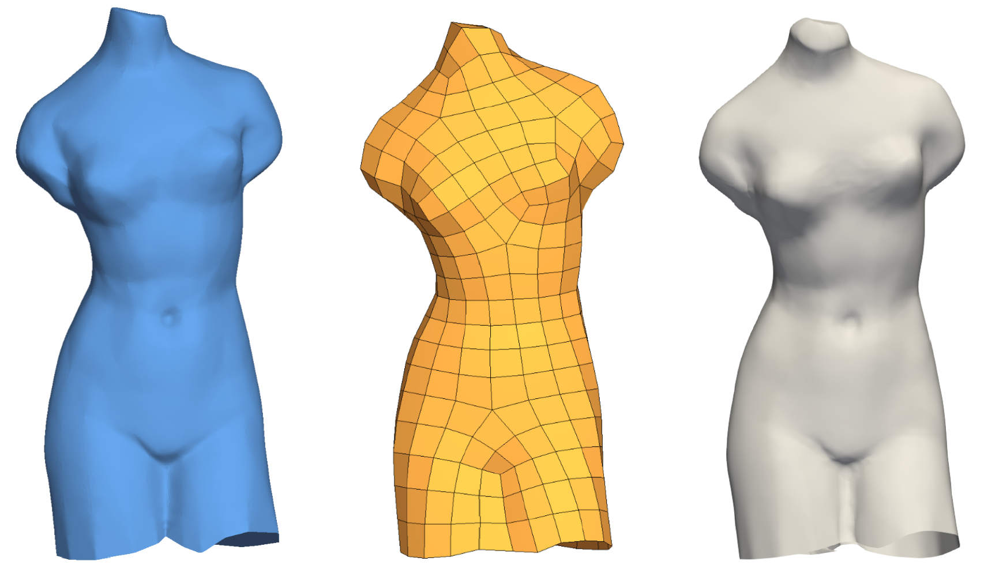

This is the source code of my thesis titled:
# Surface reconstruction from point clouds to polygonal meshes and remeshing
for the Aristotle University of Thessaloniki, in coloration with inria Sophia-Antipolis.

We are concerned with creating a coarse quad mesh from a triangle mesh, providing good quality topology.
We define a parameter space on each face and provide a projection algorithm that would map points from the original 
detailed model to the parameter space of the coarse layout mesh. 
The mesh can then be used to create a $G^1$ B-Spline surface, using [[1]](#1).
The triangle meshes can be reconstructed from a point cloud, thus we have a full pipeline from physical objects to 
spline surfaces.

## References
<a id="1">[1]</a> 
Michelangelo Marsala, Angelos Mantzaflaris, Bernard Mourrain,
G1 spline functions for point cloud fitting,
Applied Mathematics and Computation,
Volume 460,
2024,
128279,
ISSN 0096-3003,
https://doi.org/10.1016/j.amc.2023.128279.
(https://www.sciencedirect.com/science/article/pii/S0096300323004484)